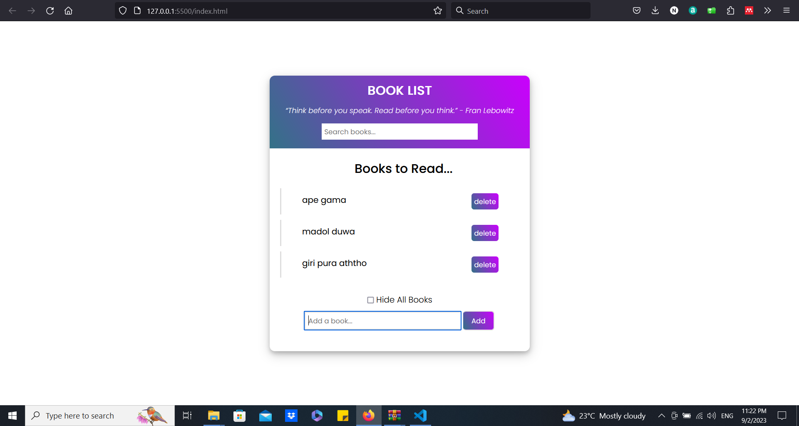

# Reading List
This is a simple web application for managing your reading list. You can add and delete books, search for books, and even hide your entire book list. 

## Features

- **Add Books:** Enter the title of a book you want to read, and click the "Add" button to add it to your list.

- **Delete Books:** Easily remove books from your list by clicking the "Delete" button next to each book.

- **Search Books:** Use the search bar to find specific books in your list.

- **Hide Books:** Check the "Hide All Books" checkbox to hide your entire list of books temporarily.

## How to Use

1. Enter the title of the book you want to add in the "Add a book..." input field and click the "Add" button.

2. To delete a book, click the "Delete" button next to the book you want to remove.

3. Use the search bar to filter your book list based on the title of the books.

4. Check the "Hide All Books" checkbox to hide all the books in your list.

## Technologies Used

- HTML
- CSS (defined in style.css)
- JavaScript (defined in script.js)

Feel free to clone this repository and use it to manage your reading list!

Happy reading!
